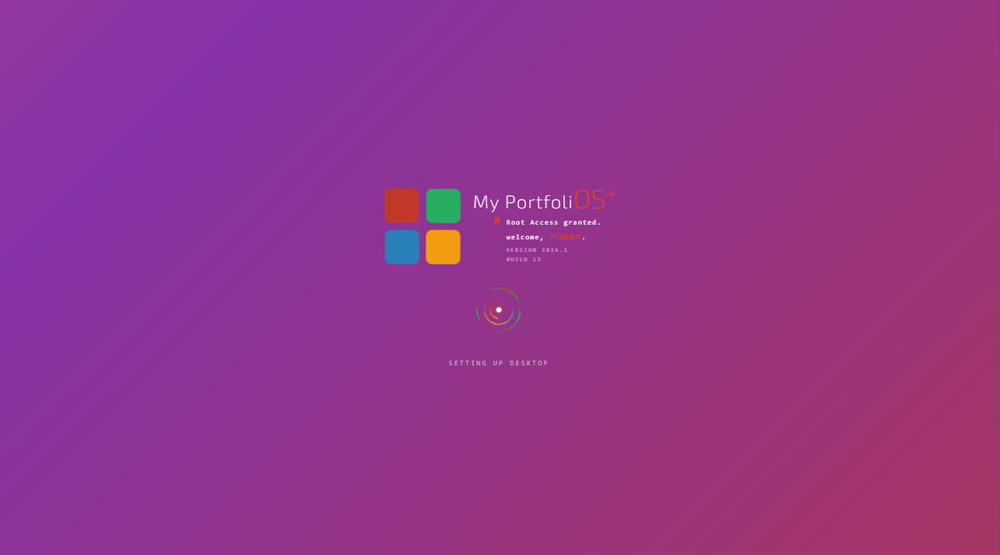
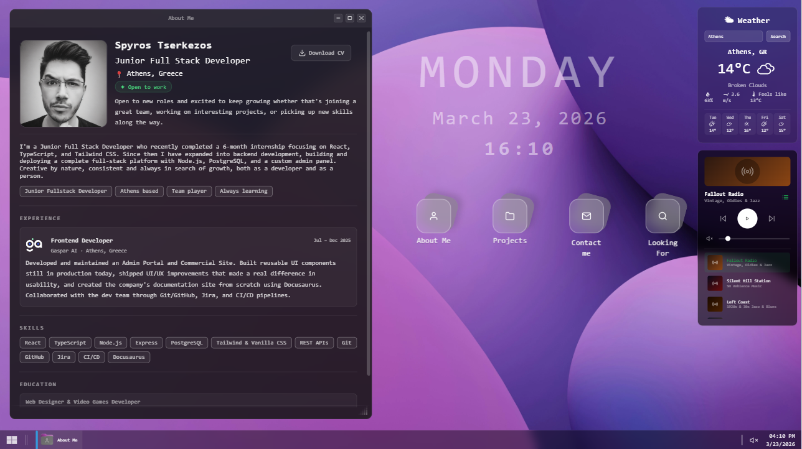

# My PortfoliOS+

> A desktop OS experience, built entirely in the browser with React & TypeScript.

[](https://spyros-tserkezos.dev)


---

## 📸 Preview




---

## 🧪 E2E Testing Demo

https://github.com/user-attachments/assets/69313609-c1e8-4451-a4d0-339bc9d6ad14

---

## ✨ Features

- 🖥️ Boot screen with BIOS animation & power-on sound
- 🖱️ Draggable & resizable windows (custom window manager)
- 🌤️ Live weather widget (OpenWeatherMap API)
- 🎵 Built-in radio player (Tunify)
- 🔊 Volume control with mute toggle
- 🕒 Live desktop clock
- 🧊 Glassmorphism icon dock
- 📱 Fully responsive layout
- 🧪 Cypress E2E tests

---

## 🛠️ Tech Stack

| Layer | Tech |
|---|---|
| Frontend | React + TypeScript |
| Build Tool | Vite |
| State Management | Zustand |
| Testing | Cypress |
| Weather API | OpenWeatherMap |
| Deployment | Vercel |

---

## 🗂️ Architecture

- **Zustand** for global state (window manager, audio)
- **Custom React hooks** for drag & resize logic (`useDraggable`)
- **Modular components** — each window is an isolated app (`AboutMe`, `Projects`, `ContactMe`, `LookingFor`)
- **Boot sequence** with multi-step state machine (`idle → bios → loading → desktop`)

---

## 🚦 Getting Started

```bash
npm install
npm run dev
```

Visit [localhost:5173](http://localhost:5173) in your browser.

---

## 📄 License

Personal portfolio - feel free to fork and adapt.

---

Made by [Spyros Tserkezos](https://spyros-tserkezos.dev)